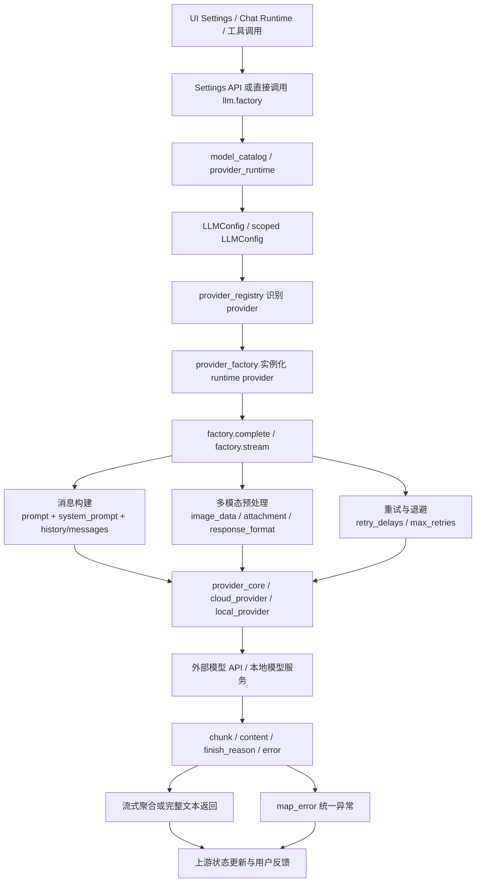

# LLM 与模型接入需求

## 1. 模块目标

LLM 与模型接入模块负责把 DeepTutor 的“模型选择、模型目录、运行时配置、请求执行、多模态输入、错误归一化”收敛成一条稳定链路。它不是单纯的 SDK 包装层，而是后端所有调用大模型能力的统一接入面。

这个模块的实际职责包括：

- 将 `model_catalog.json` 中的配置解析成当前请求可用的 `LLMConfig`。
- 根据 provider 名称、模型名、base_url、API key 和 OAuth 形态选择正确的 provider。
- 为同步完成和流式输出提供统一入口。
- 处理图片附件、thinking tag、response_format、stream_options 等能力差异。
- 把 SDK / HTTP / 状态码异常映射为统一的 `LLMError` 体系。

这个模块不负责：

- 会话存储、turn 编排和消息持久化。
- 账号权限策略的设计本身。
- 前端页面结构。
- 具体模型厂商的服务端实现。

## 2. LLM 与模型接入模块结构

### 2.1 结构职责表

| 层级 | 职责 | 关键代码 | 依赖方向 |
| --- | --- | --- | --- |
| UI / 设置页 | 编辑模型目录、测试连接、选择 active profile/model | `web/app/(utility)/settings/llm/page.tsx`、`web/components/settings/ServiceConfigEditor.tsx` | 调 API |
| API / 设置路由 | 接收配置更新、触发模型测试、清理 LLM 缓存 | `deeptutor/api/routers/settings.py` | 依赖 config/model_selection/llm |
| 配置与目录层 | 读写 `model_catalog.json`，解析运行时模型配置 | `deeptutor/services/config/model_catalog.py`、`deeptutor/services/config/provider_runtime.py` | 向下提供 resolved config |
| 选择层 | 将 profile/model 选择安全地转成 request-scoped config | `deeptutor/services/model_selection/llm.py`、`deeptutor/services/model_selection/runtime.py` | 依赖 provider_runtime + llm.config |
| LLM 编排层 | 组装消息、重试、流式、图片、错误映射 | `deeptutor/services/llm/factory.py` | 依赖 provider_registry / provider_factory |
| Provider 运行时层 | 根据 `LLMConfig` 实例化具体 provider | `deeptutor/services/llm/provider_factory.py`、`deeptutor/services/llm/provider_core/*` | 依赖外部模型 SDK / HTTP |
| 兼容层 | 旧式 class facade、环境变量兼容、OpenAI 风格 helpers | `deeptutor/services/llm/client.py`、`deeptutor/services/llm/config.py`、`deeptutor/services/llm/utils.py` | 向下复用 factory |

### 2.2 具体目录结构

```text
DeepTutorSerevr/
├── deeptutor/services/llm/
│   ├── __init__.py
│   ├── capabilities.py
│   ├── client.py
│   ├── cloud_provider.py
│   ├── config.py
│   ├── context_window.py
│   ├── error_mapping.py
│   ├── exceptions.py
│   ├── executors.py
│   ├── factory.py
│   ├── local_provider.py
│   ├── multimodal.py
│   ├── openai_http_client.py
│   ├── provider_core/
│   ├── provider_factory.py
│   ├── provider_registry.py
│   ├── providers/
│   ├── reasoning_params.py
│   ├── registry.py
│   ├── request_compat.py
│   ├── telemetry.py
│   ├── traffic_control.py
│   ├── types.py
│   └── utils.py
├── deeptutor/services/config/
│   ├── model_catalog.py
│   └── provider_runtime.py
├── deeptutor/services/model_selection/
│   ├── llm.py
│   └── runtime.py
├── deeptutor/api/routers/settings.py
├── web/app/(utility)/settings/llm/page.tsx
└── tests/services/llm/
    ├── test_config_module.py
    ├── test_factory_provider_exec.py
    ├── test_multimodal.py
    ├── test_error_mapping.py
    ├── test_provider_core_image_fallback.py
    ├── test_routing_provider.py
    ├── test_cloud_provider.py
    └── test_client.py
```

### 2.3 目录职责与依赖方向

| 目录 | 职责 | 依赖关系 |
| --- | --- | --- |
| `deeptutor/services/config/model_catalog.py` | 持久化模型目录，保存 active profile/model | 被 settings API 和 model_selection 读取 |
| `deeptutor/services/config/provider_runtime.py` | 把目录配置和上下文转为可执行的运行时配置 | 被 `llm.config` 和其他服务共用 |
| `deeptutor/services/model_selection/*` | 将选中的 profile/model 安全传给当前请求 | 被 chat/session runtime 调用 |
| `deeptutor/services/llm/factory.py` | 统一执行入口，负责重试、流式、图片、错误映射 | 调 provider_factory 和 provider_core |
| `deeptutor/services/llm/provider_core/*` | 具体 provider 实现 | 直接访问外部模型 API |
| `deeptutor/services/llm/cloud_provider.py`、`local_provider.py` | 兼容型 HTTP 调用实现 | 作为 factory 的底层执行适配 |
| `deeptutor/services/llm/client.py` | 旧式 class facade | 逐步被 factory 替代 |
| `tests/services/llm/*` | 覆盖 registry、config、factory、multimodal、错误映射和 provider 兼容 | 直接验证上面几层 |

## 3. 真实能力拆分

### 3.1 Provider 注册与识别

#### 需求说明

这个能力负责把“人类可读的 provider 名称”“模型名中的关键词”“API key / base_url 的特征”统一成一个可执行的 `ProviderSpec`。它是模型路由的单一事实源。

#### 基础要求与业务规则

| 规则 | 说明 | 代码位置 |
| --- | --- | --- |
| 统一规范名 | `canonical_provider_name()` 会把别名归一化，例如 `azure` -> `azure_openai`、`claude` -> `anthropic` | `deeptutor/services/provider_registry.py` |
| 路由优先级 | `find_gateway()` 先按显式 provider，其次按 key 前缀 / base_url 关键字识别 gateway | `deeptutor/services/provider_registry.py` |
| 模型反查 | `find_by_model()` 只对标准 provider 走关键词匹配，不把 gateway / local 误判成标准模型 | `deeptutor/services/provider_registry.py` |
| provider 分类 | registry 明确区分 direct、gateway、standard、local、oauth、auxiliary | `deeptutor/services/provider_registry.py` |
| 能力挂钩 | `supports_prompt_caching`、`supports_max_completion_tokens`、`thinking_style` 等都从 registry 提供 | `deeptutor/services/provider_registry.py` |
| 失败与恢复 | 找不到 provider 时回退到 `fallback` 或 `openai`，但前提是调用链已经给了合理的配置 | `deeptutor/services/llm/factory.py` |

#### 验收标准

- 输入 `openrouter`、`azure-openai`、`claude` 这类别名时，能稳定映射到同一个规范 provider。
- `find_gateway()` 能根据 API key 前缀或 base_url 识别 OpenRouter、NVIDIA NIM 等网关类 provider。
- 新增 provider 只需要补 `PROVIDERS`，不应再在多处手写判断。

#### 技术细节与设计代码位置

| 文件 | 作用 |
| --- | --- |
| `deeptutor/services/provider_registry.py` | ProviderSpec、alias、匹配规则、provider 列表 |
| `deeptutor/services/llm/provider_factory.py` | 根据 ProviderSpec 的 backend 实例化运行时 provider |
| `deeptutor/services/llm/capabilities.py` | 通过 binding/model 读取 provider 能力 |
| `tests/services/llm/test_registry.py`、`tests/services/llm/test_provider_core_image_fallback.py` | 验证注册和能力驱动行为 |

### 3.2 配置解析与模型目录

#### 需求说明

这个能力负责把“用户目录里的模型配置”转成当前请求真正可用的 LLM 运行时配置。它要兼容 admin / non-admin 作用域，还要保证读取到的配置能同步到环境变量和请求上下文。

#### 基础要求与业务规则

| 规则 | 说明 | 代码位置 |
| --- | --- | --- |
| 持久化目录 | 模型目录保存在 `model_catalog.json`，按 service 维度管理 `llm/embedding/search/tts/stt/imagegen/videogen` | `deeptutor/services/config/model_catalog.py` |
| 默认结构 | 空目录会自动补齐 `services.llm` 等 shell 结构 | `deeptutor/services/config/model_catalog.py` |
| active 选择 | 每个 service 维护 `active_profile_id` 和 `active_model_id` | `deeptutor/services/config/model_catalog.py` |
| 作用域隔离 | 非 admin 用户优先读自己的 PathService，admin 用户读 admin 目录 | `deeptutor/services/config/model_catalog.py` |
| 环境变量兼容 | OpenAI-compatible binding 会同步 `OPENAI_API_KEY` 和 `OPENAI_BASE_URL` | `deeptutor/services/llm/config.py` |
| 请求级覆盖 | 当前 turn 可用 `set_scoped_llm_config()` 临时覆盖全局配置 | `deeptutor/services/llm/config.py`、`deeptutor/services/model_selection/runtime.py` |
| 失败与恢复 | 缺少 model 会抛 `LLMConfigError`；配置读取失败则不伪造默认值 | `deeptutor/services/llm/config.py` |

#### 验收标准

- 读取配置时能得到 `model`、`api_key`、`base_url`、`provider_name`、`provider_mode` 等完整字段。
- `initialize_environment()` 会只在 OpenAI-compatible 场景下写入 `OPENAI_*`。
- `get_llm_config()` 在 scoped config 存在时优先使用 scoped 值。

#### 技术细节与设计代码位置

| 文件 | 作用 |
| --- | --- |
| `deeptutor/services/config/model_catalog.py` | 模型目录持久化和规范化 |
| `deeptutor/services/config/provider_runtime.py` | 从 model catalog / selection 解析运行时配置 |
| `deeptutor/services/llm/config.py` | `LLMConfig`、cache、scoped config、环境变量同步 |
| `deeptutor/services/model_selection/llm.py` | 把 selection 安全转成 active model 引用 |
| `deeptutor/services/model_selection/runtime.py` | 在当前 async context 里激活 / 重置 selection |
| `deeptutor/api/routers/settings.py` | 保存目录、清理 LLM 缓存、触发测试 |
| `tests/services/llm/test_config_module.py`、`tests/services/model_selection/test_llm_selection.py` | 覆盖 resolver、scoped config 和环境变量同步 |

### 3.3 运行时工厂与请求执行

#### 需求说明

这个能力负责把一次调用变成真正的模型请求。它要处理同步完成、流式输出、重试、消息构建、额外 headers、reasoning_effort 和 provider 适配。

#### 基础要求与业务规则

| 规则 | 说明 | 代码位置 |
| --- | --- | --- |
| 统一入口 | 新代码优先走 `complete()` / `stream()`，而不是直接调用旧 client | `deeptutor/services/llm/factory.py`、`deeptutor/services/llm/__init__.py` |
| 配置合并 | 调用方传入参数、当前 config、scoped config 会按规则合并，而不是简单覆盖 | `deeptutor/services/llm/factory.py` |
| provider 实例化 | `provider_factory.get_runtime_provider()` 根据 backend 选择 `OpenAICompatProvider`、`AnthropicProvider`、`AzureOpenAIProvider`、`OpenAICodexProvider`、`GitHubCopilotProvider` | `deeptutor/services/llm/provider_factory.py` |
| 重试策略 | 使用 `settings.retry` 的默认值，并生成指数退避时间序列 | `deeptutor/services/llm/factory.py` |
| 流式聚合 | `stream()` 会对小碎片做 coalesce，避免 UI 被过度切片 | `deeptutor/services/llm/factory.py` |
| Thinking 事件 | 流式路径会把 reasoning delta 包成 `<think>` / `</think>` 事件 | `deeptutor/services/llm/factory.py` |
| 失败与恢复 | provider 报错时统一走 `map_error()`；流式路径若 provider 返回错误且还没输出内容，则直接抛统一异常 | `deeptutor/services/llm/factory.py`、`deeptutor/services/llm/error_mapping.py` |

#### 验收标准

- `complete()` 能返回单条完整文本。
- `stream()` 能输出 chunk，并在 reasoning 内容前后包裹控制 token。
- `extra_headers`、`reasoning_effort`、`image_data` 能正确传入 provider。
- 当 `response.finish_reason == "error"` 时，调用方拿到的是统一异常，不是 provider 原始异常。

#### 技术细节与设计代码位置

| 文件 | 作用 |
| --- | --- |
| `deeptutor/services/llm/factory.py` | complete / stream / fetch_models / presets |
| `deeptutor/services/llm/provider_factory.py` | 运行时 provider 构建 |
| `deeptutor/services/llm/provider_core/base.py` | provider 抽象与 response 类型 |
| `deeptutor/services/llm/provider_core/*.py` | 各 provider 具体实现 |
| `deeptutor/services/llm/cloud_provider.py`、`deeptutor/services/llm/local_provider.py` | HTTP 执行兼容层 |
| `tests/services/llm/test_factory_provider_exec.py` | 验证 config 合并、stream 事件和 image 注入 |

### 3.4 多模态与响应规范

#### 需求说明

这个能力负责把文本消息和图片附件变成 provider 可接受的多模态消息格式。它要兼容 OpenAI-compatible、Anthropic，以及某些只接受 base64 的网关。

#### 基础要求与业务规则

| 规则 | 说明 | 代码位置 |
| --- | --- | --- |
| 乐观注入 | Stage 1 不做“先验 vision gate”，而是尽量把图片带给模型 | `deeptutor/services/llm/multimodal.py` |
| URL / base64 兼容 | 能从本地 attachment store 的 `"/api/attachments/..."` URL 解析出本地文件并转 base64 | `deeptutor/services/llm/multimodal.py` |
| Anthropic 限制 | Anthropic 路径只发 base64 image source，不发 URL 形态 | `deeptutor/services/llm/multimodal.py`、`deeptutor/services/llm/capabilities.py` |
| 图片降级 | `should_degrade_to_text()` 和 `strip_image_parts*()` 负责失败后的 text-only 回退 | `deeptutor/services/llm/multimodal.py` |
| response_format 过滤 | 不支持 `response_format` 的 provider 会在发请求前去掉该参数 | `deeptutor/services/llm/factory.py`、`deeptutor/services/llm/capabilities.py` |
| 失败与恢复 | url-only 图片无法本地解析时会统计为 dropped，而不是伪造空图片块 | `deeptutor/services/llm/multimodal.py` |

#### 验收标准

- OpenAI-compatible provider 能接收 `image_url` 数据块。
- Anthropic provider 能接收 base64 image source，不会发空图片。
- Moonshot / Kimi 这类要求 base64 的 provider，无法本地解析的 URL 会被安全丢弃并记录。
- 多模态失败后可以降级为 text-only，再走一次重试链路。

#### 技术细节与设计代码位置

| 文件 | 作用 |
| --- | --- |
| `deeptutor/services/llm/multimodal.py` | 图片注入、URL 解析、降级判断 |
| `deeptutor/services/llm/capabilities.py` | `supports_vision`、`vision_url_supported`、`supports_response_format` |
| `deeptutor/services/llm/request_compat.py` | 识别 stream_options / tool schema / image 输入不兼容 |
| `tests/services/llm/test_multimodal.py` | 覆盖 Stage 1 / Stage 2 多模态行为 |
| `tests/services/llm/test_provider_core_image_fallback.py` | 覆盖 provider 层图像 fallback |

### 3.5 错误映射与异常模型

#### 需求说明

这个能力负责把 provider SDK、HTTP 响应和自定义异常统一成 DeepTutor 自己的异常体系。它是上游 UI、turn runtime 和测试 runner 的共同错误边界。

#### 基础要求与业务规则

| 规则 | 说明 | 代码位置 |
| --- | --- | --- |
| 统一异常层级 | 所有 LLM 相关错误都收敛到 `LLMError` | `deeptutor/services/llm/exceptions.py` |
| 状态码优先 | `401`、`429` 这类状态码会先于规则匹配直接映射 | `deeptutor/services/llm/error_mapping.py` |
| SDK 兼容 | OpenAI / Anthropic SDK 的认证、限流等异常可直接映射为统一异常 | `deeptutor/services/llm/error_mapping.py` |
| 上下文窗识别 | message 中含 `context length`、`maximum context` 时映射为上下文窗异常 | `deeptutor/services/llm/error_mapping.py` |
| 失败与恢复 | 错误被标准化后，上游只需要按 `LLMAuthenticationError`、`LLMRateLimitError`、`ProviderContextWindowError` 等类型处理 | `deeptutor/services/llm/error_mapping.py` |

#### 验收标准

- 认证失败会归一成 `LLMAuthenticationError`。
- 429 / quota / rate limit 会归一成 `LLMRateLimitError`.
- 上下文窗超限会归一成 `ProviderContextWindowError`。
- 未命中的异常会落到 `LLMAPIError`，并保留 provider 与 status_code。

#### 技术细节与设计代码位置

| 文件 | 作用 |
| --- | --- |
| `deeptutor/services/llm/exceptions.py` | LLM 异常类型定义 |
| `deeptutor/services/llm/error_mapping.py` | 异常归一化 |
| `deeptutor/services/llm/cloud_provider.py`、`deeptutor/services/llm/local_provider.py` | 原始异常抛出位置 |
| `tests/services/llm/test_error_mapping.py` | 覆盖异常映射 |

## 4. 整体业务流程



```text
用户或上游服务
  ↓
读取 active profile/model 或 request-scoped selection
  ↓
解析成 LLMConfig
  ↓
识别 provider / gateway / local / oauth
  ↓
构建 runtime provider
  ↓
组装 messages、image、headers、reasoning_effort、response_format
  ↓
执行 complete 或 stream
  ↓
根据 provider 能力做 retry / fallback / coalesce
  ↓
返回文本或统一异常
```

## 5. 状态模型

这个模块主要管理的是“配置状态”和“请求态”，而不是领域业务状态。

| 状态域 | 说明 | 生命周期 | 是否持久化 |
| --- | --- | --- | --- |
| 模型目录状态 | `model_catalog.json` 中的 profile、model、active 指针 | 长期 | 是 |
| 请求选择状态 | `LLMSelection`、`scoped LLMConfig` | 单次请求 / 单个 async context | 否 |
| 当前运行配置 | `LLMConfig` 的 model、api_key、base_url、provider_name 等 | 进程内缓存或请求态 | 否 |
| provider 实例状态 | 由 `provider_factory` 创建的 runtime provider | 单次调用或短期对象 | 否 |
| 流式状态 | `saw_output`、`saw_content`、`in_think_block`、coalesce buffer | 单次 stream | 否 |
| 多模态状态 | 是否存在图片、是否需要 base64、是否丢弃 URL 图片 | 单次请求 | 否 |
| 错误终态 | `LLMAuthenticationError`、`LLMRateLimitError` 等 | 单次请求结果 | 否 |

可见的状态转换大致如下：

```text
未选择模型
  ↓
选择 profile/model
  ↓
解析成 LLMConfig
  ↓
构建 provider
  ↓
请求中
  ├─ 成功
  ├─ 认证失败
  ├─ 限流重试后失败
  ├─ 上下文窗超限
  └─ 多模态降级后成功
```

## 6. 数据与持久化

| 数据 | 存放位置 | 归属 | 说明 |
| --- | --- | --- | --- |
| 模型目录 | `model_catalog.json` | 用户 / admin scope | 保存 LLM、embedding、search 等 service 的 profile/model 列表 |
| active profile/model | `model_catalog.json` | 用户 / admin scope | 由 settings 页面和 selection 逻辑共同驱动 |
| 运行时环境变量 | `OPENAI_API_KEY`、`OPENAI_BASE_URL` | 进程级 | 仅为 OpenAI-compatible SDK 兼容而写入 |
| 请求级配置 | `ContextVar` 中的 scoped config | 当前 async context | 不落盘 |
| provider registry | `deeptutor/services/provider_registry.py` 内置常量 | 代码常量 | 不是可编辑数据文件 |
| 流式输出 | 内存队列和临时缓冲 | 单次调用 | 不落盘 |

这个模块没有独立数据库表。它的持久化只发生在模型目录文件和相关 settings 文件上，其余都是运行时态或上下文态。

## 7. 错误模型

| 错误类型 | 触发条件 | 常见处理 | 代码位置 |
| --- | --- | --- | --- |
| `LLMConfigError` | 没有 model、没有 endpoint、配置不完整 | 让设置页或调用方先补配置 | `deeptutor/services/llm/exceptions.py` |
| `LLMAuthenticationError` | 401、认证失败、无效 key | 让用户更新凭据或切换 provider | `deeptutor/services/llm/error_mapping.py` |
| `LLMRateLimitError` | 429、quota、rate limit | 触发退避或提示稍后重试 | `deeptutor/services/llm/error_mapping.py` |
| `ProviderContextWindowError` | context length / maximum context | 提示缩短输入或换更大上下文窗模型 | `deeptutor/services/llm/error_mapping.py` |
| `LLMModelNotFoundError` | provider 报 404 或 model 不存在 | 让用户换模型或更新目录 | `deeptutor/services/llm/exceptions.py` |
| `LLMAPIError` | 其他 HTTP / SDK 错误 | 统一兜底，保留 provider/status_code | `deeptutor/services/llm/exceptions.py` |
| `LLMTimeoutError` | 请求超时 | 可按调用方策略重试 | `deeptutor/services/llm/exceptions.py` |

错误处理的基本原则是：

- 先保留原始错误信息。
- 再把 provider / status_code 标准化。
- 最后再由上游决定是否重试、降级或终止。

## 8. 与其他模块的接口边界

| 上游 / 下游 | 接口模型 | 本模块负责 | 本模块不负责 |
| --- | --- | --- | --- |
| `deeptutor/api/routers/settings.py` | HTTP JSON / StreamingResponse | 保存模型目录、测试连接、清理缓存 | 不做 UI 状态管理 |
| `web/app/(utility)/settings/llm/page.tsx` | 前端表单 | 展示和提交 provider/model 配置 | 不决定 provider 路由规则 |
| `deeptutor/services/model_selection/*` | `LLMSelection` / request-scoped config | 把选择安全注入当前请求 | 不持久化业务内容 |
| `deeptutor/services/session/turn_runtime.py` | 单 turn 输入 | 读取当前选择并驱动模型调用 | 不实现 provider 适配 |
| `deeptutor/book/blocks/_llm_writer.py` | 书写器调用 | 提供稳定 LLM 执行接口 | 不定义 book 业务状态 |
| `deeptutor/services/embedding/*`、`voice/*`、`imagegen/*` | 类似 provider_runtime 的其他服务 | 共享目录/配置习惯 | 不共享本模块的错误类型细节 |

接口边界里最重要的一点是：`LLMConfig` 和 `LLMSelection` 只描述“如何调用模型”，不承载会话、任务或书籍本身的业务含义。

## 9. 关键代码对应关系

| 代码位置 | 说明 |
| --- | --- |
| `deeptutor/services/llm/__init__.py` | 对外导出主 API、异常、工具函数 |
| `deeptutor/services/llm/config.py` | `LLMConfig`、cache、scoped config、环境变量同步 |
| `deeptutor/services/llm/factory.py` | `complete()`、`stream()`、`fetch_models()`、preset 构建 |
| `deeptutor/services/llm/provider_factory.py` | 运行时 provider 实例化 |
| `deeptutor/services/provider_registry.py` | ProviderSpec、别名、匹配规则 |
| `deeptutor/services/llm/provider_core/*` | provider runtime 的主要实现 |
| `deeptutor/services/llm/cloud_provider.py` | 云端 HTTP 执行兼容层 |
| `deeptutor/services/llm/local_provider.py` | 本地模型 HTTP 执行兼容层 |
| `deeptutor/services/llm/multimodal.py` | 图片注入、降级、URL 解析 |
| `deeptutor/services/llm/error_mapping.py` | 统一异常映射 |
| `deeptutor/services/llm/client.py` | 旧式 class facade |
| `deeptutor/services/config/model_catalog.py` | 模型目录文件读写 |
| `deeptutor/services/model_selection/llm.py` | 模型选择列表和 active selection |
| `deeptutor/services/model_selection/runtime.py` | 请求级 selection 激活和恢复 |
| `deeptutor/api/routers/settings.py` | settings API 和缓存失效 |

## 10. 测试策略

| 测试文件 | 覆盖点 | 评价 |
| --- | --- | --- |
| `tests/services/llm/test_config_module.py` | config 解析、scoped config、环境变量同步、缺 model 失败 | 关键 |
| `tests/services/llm/test_factory_provider_exec.py` | factory 合并 headers、stream reasoning、图片注入 | 关键 |
| `tests/services/llm/test_multimodal.py` | 多模态 Stage 1 / Stage 2、URL 解析、Anthropic / Moonshot 行为 | 关键 |
| `tests/services/llm/test_error_mapping.py` | 异常归一化 | 关键 |
| `tests/services/llm/test_cloud_provider.py` | 云端 HTTP 请求兼容 | 关键 |
| `tests/services/llm/test_client.py` | legacy client facade | 辅助 |
| `tests/services/llm/test_openai_http_client.py` | OpenAI HTTP 辅助层 | 辅助 |
| `tests/services/llm/test_routing_provider.py`、`test_registry.py` | provider 路由 / 注册 | 辅助 |
| `tests/services/llm/test_llm_live.py` | 真实联通测试 | 需要环境支持 |

当前测试的优点是把“配置、工厂、多模态、错误”拆开了；不足是不同 provider 的 live coverage 仍然依赖外部网络和凭据，回归成本偏高。

## 11. 当前实现、缺口与演进

### 当前实现

- 已经形成了 `provider_registry -> provider_factory -> runtime provider -> error_mapping` 的稳定链路。
- `factory.complete()` 和 `factory.stream()` 是实际主入口。
- 多模态不是简单开关，而是“乐观注入 + 失败后降级”的两阶段流程。
- `model_catalog.json`、request-scoped selection 和 settings API 已经连成闭环。

### 现存缺口

- `client.py`、`registry.py` 等兼容层仍然存在，说明历史调用面还没有完全收敛。
- provider 能力同时分散在 registry、capabilities 和具体 provider 实现中，长期看会有重复表达风险。
- `fetch_models()` 依赖远端服务可达性，测试和生产环境都容易受到网络波动影响。
- 不同 provider 的细粒度错误文案差异较大，当前主要靠规则和关键词归一化。

### 演进建议

| 建议 | 收益 | 代价 |
| --- | --- | --- |
| 收敛旧 client 和旧 registry 调用面 | 降低维护成本，减少双入口 | 需要迁移少量旧代码 |
| 进一步统一 provider 能力元数据 | 减少 capability / registry 双写 | 需要清理历史兼容字段 |
| 为主要 provider 增加更稳定的契约测试 | 降低回归风险 | 需要更多凭据和 mock 资产 |
| 把 settings 测试连接做成更强的契约层 | 更容易定位模型配置问题 | 需要更多 UI / API 联动测试 |

## 12. 整体验收标准

- [ ] `provider_registry.py` 能唯一解释 provider 名称、别名和分类。
- [ ] `model_catalog.json` 可以正确读写，并且 active profile/model 选择稳定。
- [ ] `get_llm_config()`、`set_scoped_llm_config()` 和 `reset_llm_selection()` 能在单请求内正确生效。
- [ ] `complete()` 与 `stream()` 都能正常走 provider_factory 和统一异常映射。
- [ ] 图片附件在 OpenAI-compatible、Anthropic 和 base64-only provider 下都能得到正确处理。
- [ ] `response_format`、stream 控制和 thinking tag 能按 provider 能力自动适配。
- [ ] 认证失败、限流、上下文窗超限都能映射到统一异常类型。
- [ ] settings API 变更后能够清理 LLM 缓存并反映到下一次请求。
- [ ] 关键路径至少有 config、factory、multimodal、error mapping、provider compatibility 的测试覆盖。
