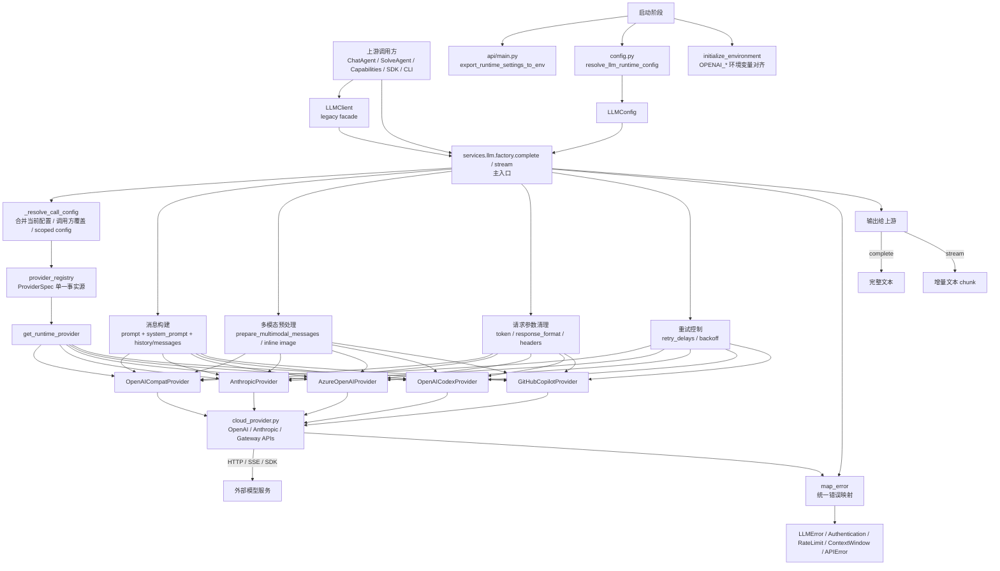
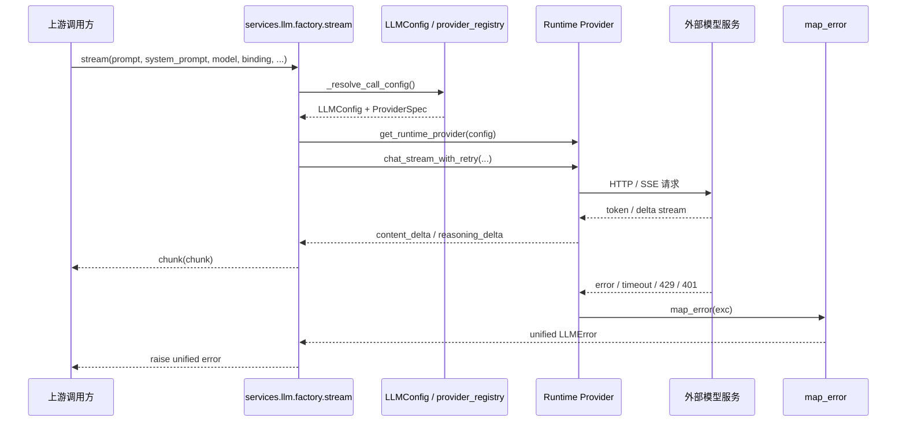
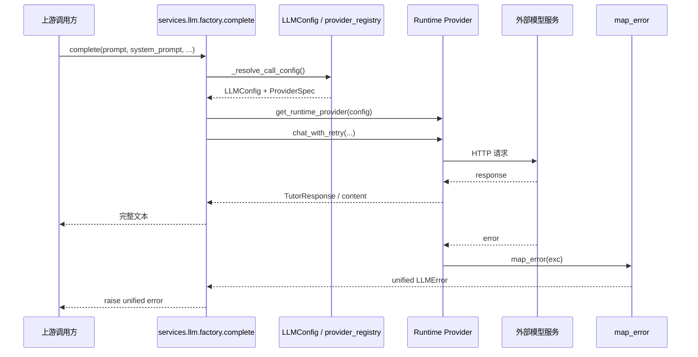

# LLM 与模型接入完整流程架构图

这份图把 `DeepTutorSerevr` 里 LLM 接入的完整链路串起来，包括：

- 上游谁在调用 LLM
- 配置与模型如何进入运行时
- Provider 如何选择与实例化
- 同步/流式两种请求如何执行
- 错误如何统一映射

## 1. 总体架构图



## 2. 流式请求时序图



## 3. 同步请求时序图



## 4. 关键分层

### 4.1 调用层

- `deeptutor/app/facade.py`、各类 Agent、工具和 CLI 会调用 LLM 服务。
- `deeptutor/services/llm/client.py` 是旧式面向对象入口，内部仍委托给 factory。
- 新代码优先走 `deeptutor.services.llm.complete` / `stream`。

### 4.2 配置层

- `deeptutor/services/llm/config.py`
  - 从运行时配置解析当前 `LLMConfig`
  - 负责缓存、scoped config、`OPENAI_*` 环境变量对齐
- `deeptutor/services/provider_registry.py`
  - LLM provider 的单一事实源
  - 决定 provider 名称、backend、是否 gateway、是否 local、认证模式等

### 4.3 适配层

- `deeptutor/services/llm/factory.py`
  - 对外主入口
  - 合并当前配置、调用方覆盖、LLM selection、额外 headers、reasoning_effort
  - 构建 messages、处理多模态、重试、错误映射
- `deeptutor/services/llm/provider_factory.py`
  - 根据 `LLMConfig` 和 `ProviderSpec` 构建具体运行时 provider

### 4.4 执行层

- `deeptutor/services/llm/cloud_provider.py`
  - OpenAI / Anthropic / 兼容网关的云端调用
- `deeptutor/services/llm/local_provider.py`
  - Ollama / LM Studio / vLLM 等本地模型调用
- `deeptutor/services/llm/providers/*`
  - 底层 provider 实现与协议封装

### 4.5 统一异常层

- `deeptutor/services/llm/error_mapping.py`
  - 把 SDK / HTTP / 状态码异常统一成 `LLMError` 系列
- 常见终态包括：
  - 认证失败
  - 速率限制
  - 上下文窗超限
  - 通用 API 错误

## 5. 一次请求的完整流程

```text
上游调用方
  ↓
LLMClient 或 services.llm.complete/stream
  ↓
读取当前 LLMConfig
  ↓
_resolve_call_config 合并调用方参数与运行时配置
  ↓
provider_registry 识别 provider / gateway / local / oauth
  ↓
provider_factory 构建 runtime provider
  ↓
factory 组装 messages、图片、多模态、token 参数、重试参数
  ↓
cloud_provider / local_provider 发起真实请求
  ↓
同步完成：返回完整文本
  ↓
流式完成：逐段吐出 chunk
  ↓
异常：map_error 统一成 LLMError
```

## 6. 代码位置

- 对外入口: `deeptutor/services/llm/__init__.py`
- 旧式客户端: `deeptutor/services/llm/client.py`
- 主工厂: `deeptutor/services/llm/factory.py`
- Provider 运行时工厂: `deeptutor/services/llm/provider_factory.py`
- Provider 注册表: `deeptutor/services/provider_registry.py`
- 配置解析: `deeptutor/services/llm/config.py`
- 错误映射: `deeptutor/services/llm/error_mapping.py`
- 云端适配: `deeptutor/services/llm/cloud_provider.py`
- 本地适配: `deeptutor/services/llm/local_provider.py`
- 多模态: `deeptutor/services/llm/multimodal.py`

