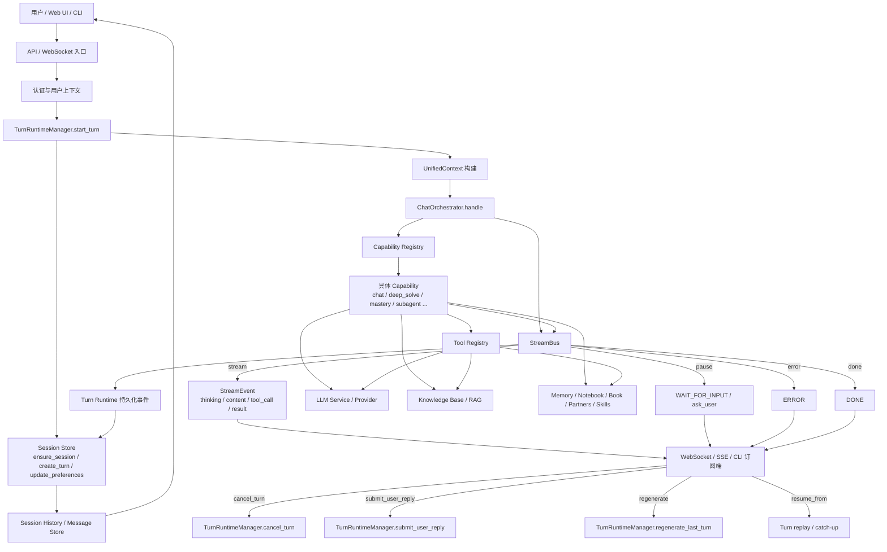
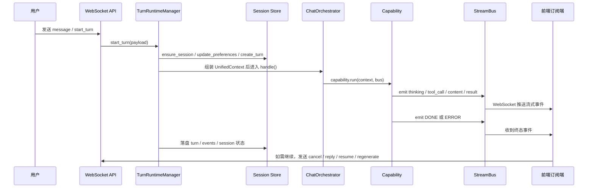

# 用户对话完整流程架构图

下面这张图描述 `DeepTutorSerevr` 中“用户发起一次对话”从入口、编排、执行、流式回传、持久化到恢复/取消的完整路径。

## 1. 完整架构图

## 2. 一次对话的主流程

## 3. 流程拆解

### 3.1 入口层

- `deeptutor/api/routers/unified_ws.py` 提供统一 WebSocket 入口。
- `deeptutor/api/routers/chat.py` 提供旧版 chat WebSocket 入口。
- CLI / SDK / 其他适配层最终都会落到 `deeptutor/app/facade.py` 或 `TurnRuntimeManager`。

### 3.2 编排层

- `deeptutor/services/session/turn_runtime.py` 负责 session、turn、偏好设置、恢复、取消、重放。
- `deeptutor/core/context.py` 负责统一上下文对象 `UnifiedContext`。
- `deeptutor/runtime/orchestrator.py` 负责把上下文路由到具体 capability。

### 3.3 执行层

- Capability 通过 `StreamBus` 持续输出事件。
- Capability 内部可以调用 `ToolRegistry`、LLM、RAG、记忆、Notebook、Book、伙伴、技能与子代理。
- `StreamEventType` 统一定义了 `thinking`、`content`、`tool_call`、`tool_result`、`error`、`done`、`wait_for_input` 等事件。

### 3.4 回传与恢复

- `StreamBus` 将事件实时广播给订阅者。
- WebSocket 端支持：
  - `subscribe_turn`
  - `subscribe_session`
  - `resume_from`
  - `cancel_turn`
  - `submit_user_reply`
  - `regenerate`
- `TurnRuntimeManager` 会在断线或重启后回放已持久化事件，并对孤儿 running turn 做恢复或终止处理。

## 4. 关键代码位置

- 入口与 facade: `deeptutor/app/facade.py`
- 统一编排: `deeptutor/runtime/orchestrator.py`
- 对话上下文: `deeptutor/core/context.py`
- 流式事件协议: `deeptutor/core/stream.py`
- 流式总线: `deeptutor/core/stream_bus.py`
- Turn 运行时: `deeptutor/services/session/turn_runtime.py`
- 会话管理: `deeptutor/services/session/unified_session_manager.py`
- 统一 WebSocket: `deeptutor/api/routers/unified_ws.py`
- 旧版 Chat WebSocket: `deeptutor/api/routers/chat.py`

## 5. 这条链路里的几个关键点

- 用户请求不是直接进 capability，而是先经过 `TurnRuntimeManager` 做会话与 turn 编排。
- 流式输出不是一次性返回，而是通过 `StreamBus` 逐段广播。
- `DONE` 和 `ERROR` 都是终态事件，前端需要依赖它们收敛 loading 状态。
- `wait_for_input` 说明这条链路支持中途暂停，等待用户继续回答。
- `resume_from` 和 `subscribe_turn` 说明这套对话是可恢复、可回放的，不是纯粹的一次性流式接口。

