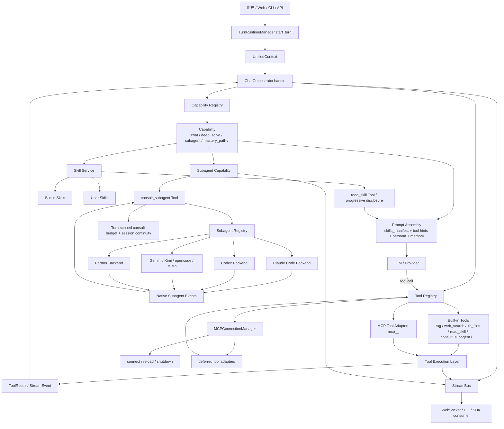
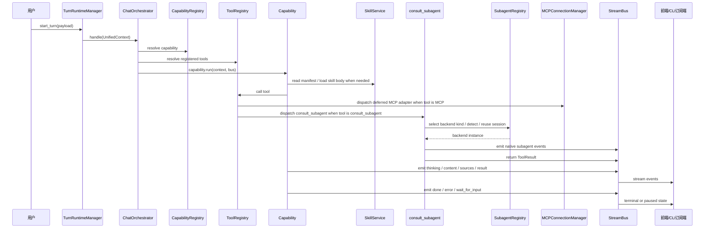

# 技能、子代理与工具生态完整流程架构图

这张图描述 DeepTutor 在一次对话中，如何把“技能（Skill）”“子代理（Subagent）”“工具（Tool）”和“MCP 插件工具”串成一条完整链路。

## 1. 总体架构图

## 2. 完整流程

## 3. 关键分层职责

### 3.1 技能层

- `deeptutor/services/skill/service.py` 负责技能目录的发现、读取、安装、权限边界与标签管理。
- 技能不会整段注入系统提示，通常只先进入 manifest，按需通过 `read_skill` 读取。
- `always: true` 的技能会被提早注入，用于必须始终生效的系统规则。

### 3.2 工具层

- `deeptutor/runtime/registry/tool_registry.py` 负责所有工具的注册、别名解析、OpenAI schema 构建和执行分发。
- 内置工具定义来自 `deeptutor/tools/builtin/__init__.py`。
- MCP 工具会被包装成 `deferred` 的适配器，按需暴露给模型。

### 3.3 子代理层

- `deeptutor/capabilities/subagent/capability.py` 决定本轮是否启用子代理能力。
- `deeptutor/capabilities/subagent/tools.py` 提供唯一入口 `consult_subagent`。
- `deeptutor/services/subagent/registry.py` 管理所有可连接的子代理后端。
- `deeptutor/services/subagent/base.py` 定义子代理后端契约。
- `deeptutor/services/subagent/sessions.py` 负责跨 turn 续接同一个子代理会话。

### 3.4 MCP 层

- `deeptutor/services/mcp/manager.py` 管理 MCP server 的连接、重连、超时与工具适配。
- MCP 适配器默认是 `deferred`，不会一开始就把全部 schema 塞给模型。
- 加载、重载、关闭都由一个进程级 manager 统一控制。

## 4. 这个生态的核心流转规则

1. capability 决定“这一轮能不能用某类能力”。
2. tool registry 决定“模型能调用哪些工具”。
3. skill service 决定“模型能读哪些知识型 playbook”。
4. subagent capability 决定“这一轮是否存在外部代理可咨询”。
5. MCP manager 决定“远端工具服务器是否在线并可执行”。
6. StreamBus 负责把执行过程实时回传给前端或 CLI。

## 5. 关键代码位置

- 能力注册：`deeptutor/runtime/registry/capability_registry.py`
- 工具注册：`deeptutor/runtime/registry/tool_registry.py`
- 内置能力清单：`deeptutor/runtime/bootstrap/builtin_capabilities.py`
- 技能服务：`deeptutor/services/skill/service.py`
- 子代理能力：`deeptutor/capabilities/subagent/capability.py`
- 子代理工具：`deeptutor/capabilities/subagent/tools.py`
- 子代理后端注册：`deeptutor/services/subagent/registry.py`
- 子代理后端契约：`deeptutor/services/subagent/base.py`
- 子代理会话记忆：`deeptutor/services/subagent/sessions.py`
- MCP 连接管理：`deeptutor/services/mcp/manager.py`
- 工具协议：`deeptutor/core/tool_protocol.py`

## 6. 一句话总结

DeepTutor 的“技能、子代理与工具生态”不是三套平行系统，而是一个统一调度面：

- `Capability` 决定策略边界，
- `ToolRegistry` 决定动作边界，
- `SkillService` 决定知识边界，
- `SubagentRegistry` 决定外部代理边界，
- `MCPConnectionManager` 决定外部工具边界。

