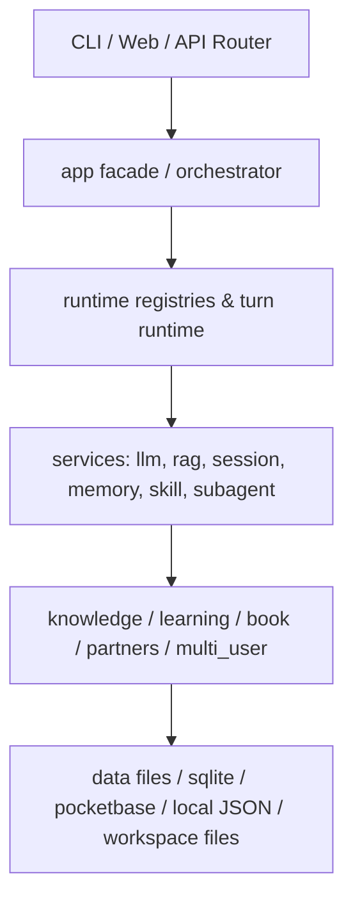
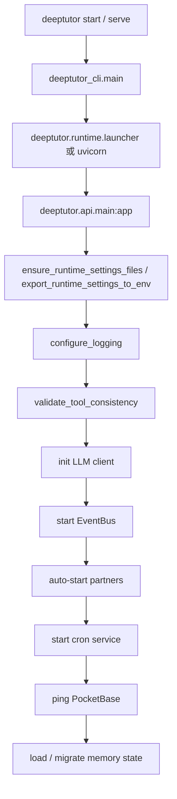

# DeepTutor 项目汇总

## 1. 文档定位

这份文档是 `DeepTutorSerevr` 项目的总领说明，目标是把真实代码中的启动方式、分层结构、核心模块、关键流程、数据落点和测试边界整理成团队可直接引用的 Markdown 参考。

本文档基于以下事实来源整理：

- 项目入口与配置：`pyproject.toml`、`requirements.txt`、`deeptutor/api/main.py`、`deeptutor/api/run_server.py`、`deeptutor_cli/main.py`
- 运行时与编排：`deeptutor/app/facade.py`、`deeptutor/runtime/*`、`deeptutor/core/*`
- 业务模块：`deeptutor/knowledge/*`、`deeptutor/book/*`、`deeptutor/learning/*`、`deeptutor/partners/*`、`deeptutor/multi_user/*`、`deeptutor/services/*`
- 前端工作台：`web/app/*`、`web/features/*`

## 2. 项目概览

DeepTutor 是一个以 Python 为主、前后端一体化的 agent-native 学习工作台。它把聊天、研究、知识库检索、Book 编排、学习掌握、伙伴 IM、记忆、Notebook、技能和子代理等能力放在同一个运行时中。

项目的实际形态不是“单一聊天应用”，而是一个模块化单体：

- 后端以 `FastAPI` + `Uvicorn` 为 API 和 WebSocket 承载层。
- 运行时以统一的 capability registry / tool registry 为调度中心。
- LLM、RAG、会话、学习、伙伴、记忆、Book 都是独立服务层。
- 前端是 `Next.js 16` 工作台，按 workspace / utility / admin 路由组织功能页。
- CLI 与 Web API 共用同一套核心应用层契约。

## 3. 项目目录结构

只列出理解架构所需的层级：

```text
DeepTutorSerevr/
├── deeptutor/
│   ├── api/                # FastAPI 路由层
│   ├── app/                # 应用门面
│   ├── book/               # Book 引擎
│   ├── capabilities/       # 内置 capability
│   ├── config/             # 进程配置与默认值
│   ├── core/               # 流、上下文、协议
│   ├── learning/           # 学习与掌握
│   ├── knowledge/          # 知识库管理
│   ├── multi_user/         # 多用户与授权
│   ├── partners/           # IM 伙伴与渠道
│   ├── runtime/            # 启动、注册表、模式
│   ├── services/           # LLM/RAG/会话/记忆/技能/子代理等服务
│   ├── tools/              # 内置工具
│   └── utils/              # 文档解析、JSON、错误处理等通用工具
├── deeptutor_cli/          # Typer CLI
├── web/                    # Next.js 前端工作台
├── tests/                  # 后端和核心服务测试
├── requirements/           # 可选依赖清单
├── assets/                 # 截图、图标、发布说明
└── 总领文档/               # 本次补写的项目说明
```

## 4. 应用分层与依赖方向

当前代码更接近“分层模块化单体”，而不是严格 DDD。依赖方向大致如下：



要点：

- `deeptutor.app.facade.DeepTutorApp` 是最稳定的应用层入口。
- `deeptutor.runtime.orchestrator.ChatOrchestrator` 负责把一次 turn 路由到 capability。
- `deeptutor.runtime.registry.capability_registry` 和 `tool_registry` 负责发现和装配能力/工具。
- `deeptutor.api.main` 负责 FastAPI 生命周期、CORS、日志、启动检查。
- 业务服务直接依赖本地文件、JSON、SQLite 或 PocketBase，并没有统一数据库抽象。

## 5. 应用启动与全局生命周期

### 启动链路



### 启动入口

- CLI 总入口：`deeptutor_cli/main.py`
- 后端服务入口：`deeptutor/api/run_server.py`
- API 应用：`deeptutor/api/main.py`
- 运行时主页：`deeptutor/runtime/home.py`
- 本地 Web 启动器：`deeptutor/runtime/launcher.py`

### 全局生命周期特征

- 启动时先加载 runtime settings，再导出到环境变量。
- 启动时会校验 capability 里引用的工具是否真的注册。
- EventBus、伙伴自动启动、cron、PocketBase 检查都在应用生命周期里进行。
- 记忆层会做历史迁移，说明项目里存在版本演进和数据兼容逻辑。

## 6. 核心模块地图

| 一级模块 | 主要职责 | 关键代码 | 主要前端/接口 |
| --- | --- | --- | --- |
| 基础工程与运行环境 | 启动、配置、日志、进程管理、运行根目录 | `deeptutor/api/main.py`、`deeptutor/api/run_server.py`、`deeptutor_cli/main.py`、`deeptutor/runtime/*`、`deeptutor/config/*` | 全局启动、设置、环境配置 |
| 对话与会话运行时 | 单 turn 编排、流式事件、会话持久化、取消/重生成 | `deeptutor/app/facade.py`、`deeptutor/runtime/orchestrator.py`、`deeptutor/services/session/*`、`deeptutor/core/*` | `web/app/(workspace)/page.tsx`、`web/app/(workspace)/layout.tsx`、`deeptutor/api/routers/chat.py`、`deeptutor/api/routers/sessions.py` |
| LLM 与模型接入 | Provider 识别、路由、SDK 包装、错误映射 | `deeptutor/services/llm/*`、`deeptutor/services/provider_registry.py` | `web/app/(utility)/settings/page.tsx`、模型设置 |
| 知识库与 RAG | 知识库 CRUD、文档导入、检索引擎选择、版本管理 | `deeptutor/knowledge/*`、`deeptutor/services/rag/*`、`deeptutor/api/routers/knowledge.py` | `web/app/(utility)/knowledge/page.tsx` |
| Book 与内容编排 | Book proposal、spine、page 编译、块级内容生成 | `deeptutor/book/*`、`deeptutor/api/routers/book.py` | `web/app/(workspace)/book/page.tsx` |
| 学习与掌握 | Mastery、测验评分、间隔复习、进度保存 | `deeptutor/learning/*`、`deeptutor/api/routers/mastery_path.py`、`deeptutor/api/routers/question.py`、`deeptutor/api/routers/quiz_judge.py` | `web/app/(utility)/space/page.tsx`、学习相关页面 |
| 记忆与笔记 | L1/L2/L3 记忆、snapshot、trace、Notebook 记录 | `deeptutor/services/memory/*`、`deeptutor/services/notebook/*`、`deeptutor/api/routers/memory.py`、`deeptutor/api/routers/notebook.py` | `web/app/(utility)/memory/page.tsx`、`web/app/(utility)/notebook/page.tsx` |
| 伙伴与外部渠道 | IM 伙伴、channel manager、消息路由、回放和分支 | `deeptutor/partners/*`、`deeptutor/services/partners/*`、`deeptutor/api/routers/partners.py` | `web/app/(workspace)/partners/page.tsx` |
| 多用户与权限 | 用户隔离、授权、资源分配、admin 操作审计 | `deeptutor/multi_user/*`、`deeptutor/api/routers/auth.py`、`deeptutor/api/routers/mobile_auth.py` | `web/features/multi-user/*`、`web/app/(admin)` |
| 技能、子代理与工具生态 | 技能管理、子代理、工具注册、MCP、社区安装 | `deeptutor/services/skill/*`、`deeptutor/services/subagent/*`、`deeptutor/runtime/registry/*`、`deeptutor/tools/*`、`deeptutor/skills/builtin/*` | `web/app/(utility)/agents/page.tsx`、`web/app/(utility)/settings/page.tsx` |

## 7. 关键业务流程

### Turn 处理流程

```text
用户输入
  ↓
API / CLI 组装 TurnRequest
  ↓
DeepTutorApp.start_turn()
  ↓
CapabilityRegistry 解析 capability
  ↓
TurnRuntime 启动会话与 turn
  ↓
Capability.run(context, bus)
  ↓
ToolRegistry / RAG / LLM / 业务服务
  ↓
StreamBus 向前端或 CLI 输出增量事件
  ↓
完成事件写入 EventBus / 会话存档
```

### 知识库导入流程

```text
上传文件
  ↓
DocumentValidator / DocumentAdder
  ↓
KnowledgeBaseManager 更新 KB 状态
  ↓
选择 RAG provider
  ↓
分支到 LlamaIndex / PageIndex / GraphRAG / LightRAG / 外部服务
  ↓
完成后写入版本与进度
```

## 8. 数据、状态与持久化

主要持久化面：

- `data/user/settings/`：运行设置、模型目录、启动配置。
- `data/user/runtime/`：运行时缓存、Web 缓存、会话状态。
- `data/knowledge_bases/`：知识库文件、索引版本、导入进度。
- `data/memory/`：记忆层、snapshot、trace、汇总文档。
- `data/partners/`：伙伴配置、会话和通道状态。
- `data/system/`：系统级运行信息。
- `data/user/`：用户级 workspace 数据。

状态类型在项目里是分散管理的：

- 瞬时 UI 状态在前端组件和上下文中。
- 会话状态在 session store 中。
- 领域状态分布在 Knowledge/Book/Learning/Memory/Partner 各自的 service 存储里。
- 运行时状态由 EventBus、StreamBus、cron、partner manager 和各类 registry 维护。

## 9. 关键技术标准

- 语言与运行时：Python 3.11+，上限 `<3.14`。
- 后端：FastAPI、Uvicorn、WebSocket、Pydantic v2。
- 前端：Next.js 16、React 19。
- LLM：OpenAI-compatible、Anthropic、Eden AI、OpenRouter、Azure OpenAI、Atlas Cloud 等多供应商路由。
- RAG：LlamaIndex、PageIndex、GraphRAG、LightRAG、linked KB、Obsidian。
- 存储：JSON 文件、SQLite、PocketBase、workspace 文件系统。
- 事件：StreamBus + EventBus 双层流式/全局事件体系。
- 语言：英文和中文并存，UI 有 i18n 与能力描述翻译。

## 10. 测试策略

项目已有较完整的测试分布：

- `tests/services/session/*` 覆盖会话存储、附件、turn runtime、source inventory。
- `deeptutor/learning/tests/*` 覆盖学习评分、掌握度、策略、API、存储。
- `tests/api/*`、`tests/book/*`、`tests/knowledge/*`、`tests/runtime/*`、`tests/multi_user/*`、`tests/partners/*`、`tests/tools/*` 覆盖核心子系统。

当前可观察到的风险点：

- 业务状态多且跨文件系统，回归测试需要覆盖并发和重试。
- 启动链路同时涉及环境变量、文件系统、外部服务和后台任务，集成测试比单元测试更重要。
- 检索和模型路由依赖配置较多，建议为 provider 切换和降级路径保留回归测试。

## 11. 现有专项文档与总览关系

现有专项文档主要在：

- `需求文档/web/问题修复工单-移动端Home双实例渲染与布局适配回归.md`
- `需求文档/web/移动端适配实际落地实施方案.md`
- `需求文档/web/移动端底部导航与右侧控制面板适配需求文档.md`
- `需求文档/web/问题修复工单-Next16移动端Hydration属性不一致.md`

这些文档更偏前端专项，而本总领文档负责补齐整个项目的模块地图、启动链路、服务依赖和数据边界。

## 12. 实现顺序与演进建议

1. 先稳住基础工程与运行环境，因为它决定配置、日志、启动和目录。
2. 再梳理对话与会话运行时，确保所有 capability 都共用一条 turn 主链路。
3. 然后巩固 LLM 与 RAG，因为它们是知识、Book、伙伴和学习能力的共同底座。
4. 接着整理 Book、学习、记忆、伙伴等产品功能，统一状态和持久化约定。
5. 最后收敛多用户、权限、技能、子代理与工具生态，降低横切复杂度。

建议的演进方向：

- 把跨模块公共契约进一步集中到 `deeptutor/core` 和 `deeptutor/app`。
- 让会话、知识库、记忆和 Book 的状态字段更一致，降低前端适配成本。
- 为外部服务降级路径补更多集成测试，尤其是 LLM / RAG / PocketBase / IM 渠道。

## 13. 架构验收清单

- [ ] `deeptutor_cli/main.py`、`deeptutor/api/main.py` 和 `deeptutor/runtime/launcher.py` 的启动职责清晰分离。
- [ ] `DeepTutorApp` 是 CLI / API 共用的稳定应用层入口。
- [ ] `CapabilityRegistry` 和 `ToolRegistry` 的启动校验能发现配置漂移。
- [ ] 知识库、Book、Learning、Memory、Partner 和 multi-user 都有独立服务层与测试。
- [ ] 前端路由与后端核心模块一一对应，不存在明显“有页面没服务”或“有服务没入口”的模块悬空。
- [ ] 数据目录、运行目录、系统目录和用户目录边界明确。
- [ ] 关键降级路径、重试路径和取消路径均有测试覆盖。

